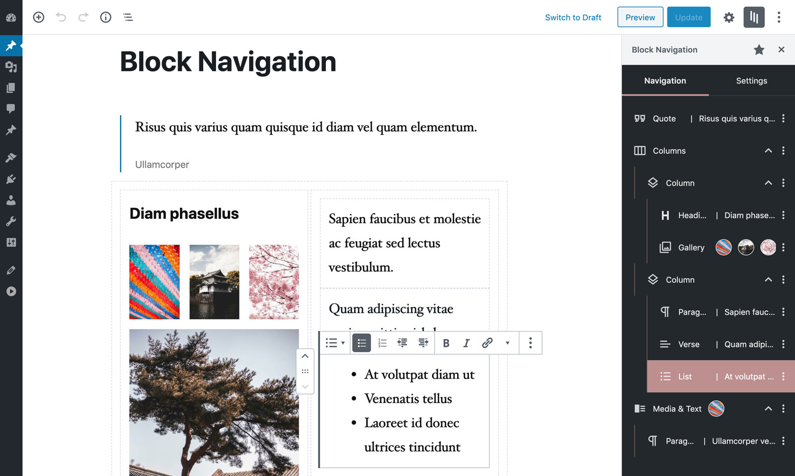
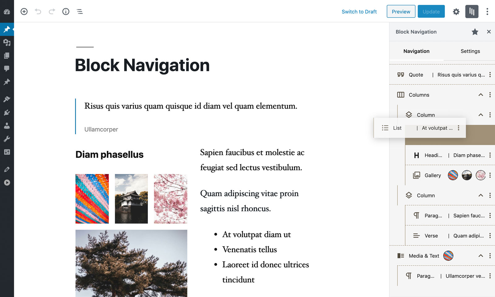
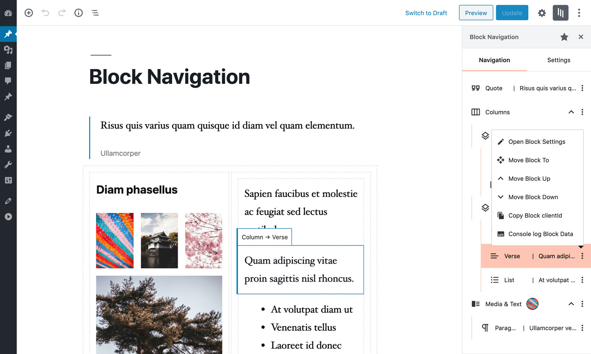

# Block Navigation

[Demo](https://gutenberg-showcase.melonpan.io/block-navigation) - [Documentation](https://melonpan.io/wordpress-plugins/block-navigation) - [WordPress](https://wordpress.org/plugins/block-navigation)

 

Block Navigation provides a sidebar with the current post/page’s blocks and some tools to facilitate the editing process in the new Gutenberg editor.

 

## Features

The features are especially useful for nested blocks – blocks that are inside parent blocks which are difficult to select or move in the editor.

Inside the panel several utilities are included to enhance the UX, such as:

- Dragging blocks to a different location
- Moving blocks by click
- Selecting blocks
- Easily recognising the block from a small snippet of the block’s content

The user can select a dark or light color scheme, from the multiple included.

 

## Plugin and Theme developers

The plugin also provides some features for Plugin and Theme developers, such as:

- Click and Copy the block’s clientId
- Click to console.log helpful data from the block

 

## Screenshots

