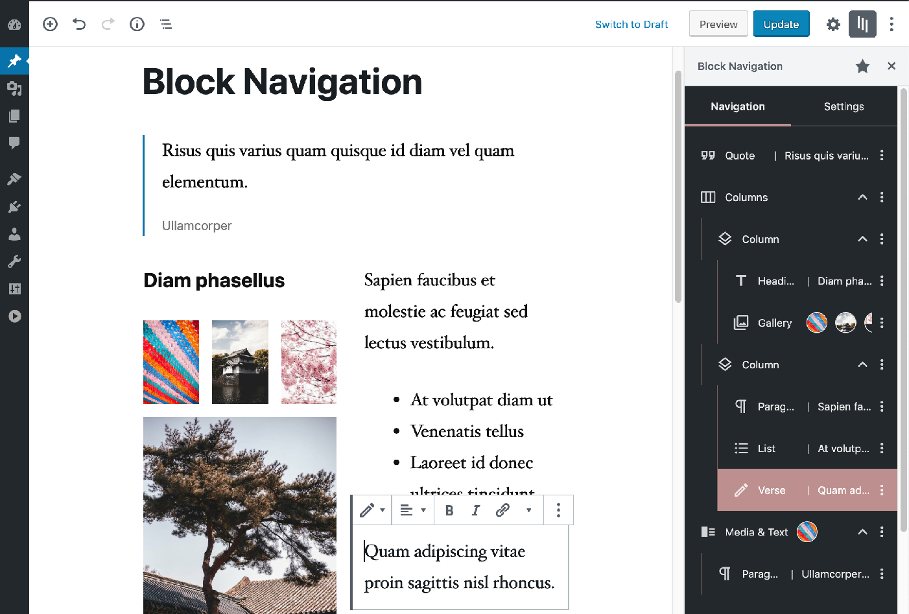
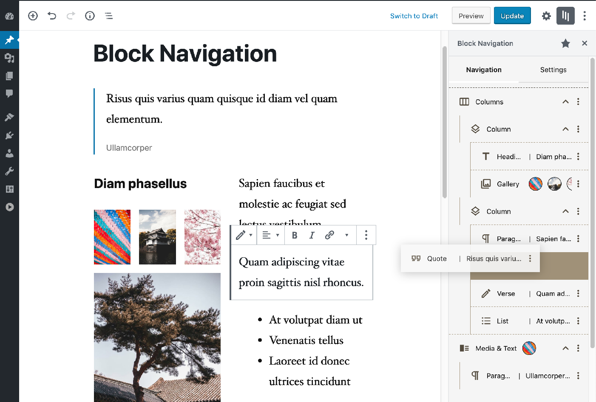
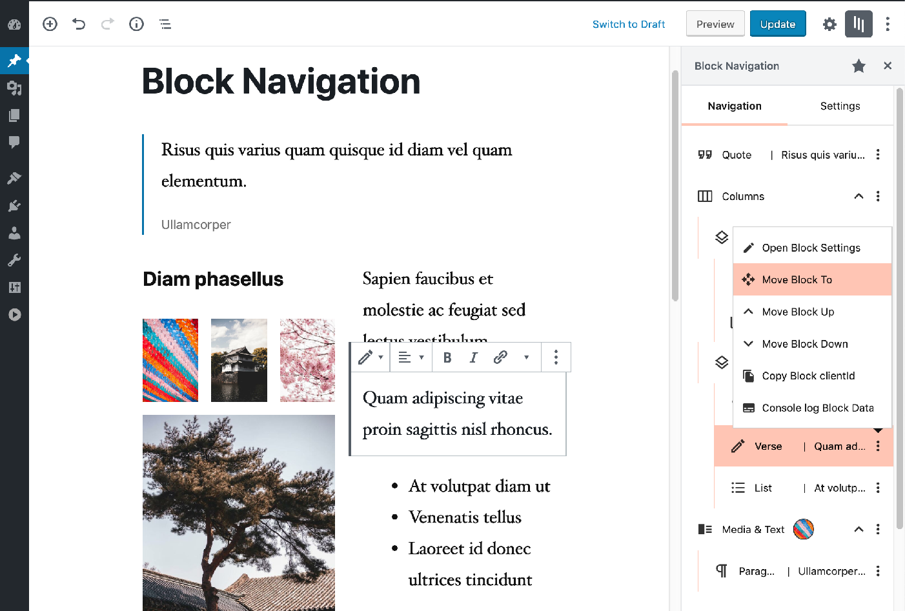
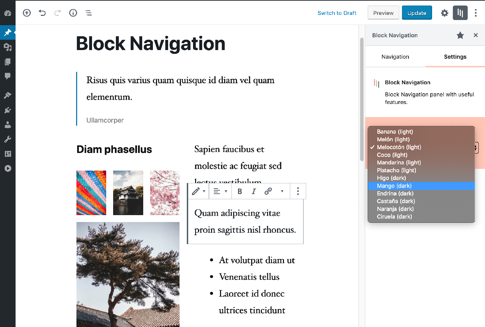

# Block Navigation

Block Navigation provides a sidebar with the current post/page's blocks and some tools to facilitate the editing process in the new Gutenberg editor.

The features are especially useful for nested blocks - blocks that are inside parent blocks which are difficult to select or move in the editor.

 

## Features

Inside the panel several utilities are included to enhance the UX, such as:

- Dragging blocks to a different location
- Moving blocks by click
- Selecting blocks
- Easily recognising the block from a small snippet of the block’s content

The plugin also provides some features for **Plugin and Theme developers** such as:

- Click and Copy the block’s clientId
- Click to console.log helpful data from the block

The Plugin also lets the user select a color scheme from multiple dark and light schemes.

 

## Usage

Inside the Block editor, the Plugin can be opened from the Show More button (the 3 dots on the right side of the Editor Top Bar).

Click the More button and inside the menu list click on the plugin name **Block Navigation**.

---

This plugin can be downloaded from the [WordPress repository](https://wordpress.org/plugins/block-navigation/).
